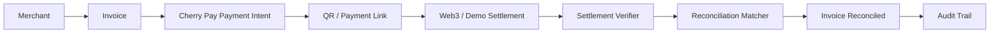

# Cherry Pay

**Intelligent Payments & Reconciliation**

Cherry Pay is a standalone NTU InnovateX 2026 prototype that connects an invoice to a payment intent, independently verifiable settlement evidence, deterministic matching, automatic reconciliation and an immutable-style audit trail.

> **Hackathon prototype. Demo/testnet only. Not intended for production funds.**

## The problem

Businesses commonly use separate systems for invoicing, payment, settlement, reconciliation and accounting. Context gets lost between them, creating manual work and uncertainty about whether an invoice is actually settled.

## Our solution

```text
Invoice
→ Payment Intent + QR
→ Settlement
→ Intelligent Matching
→ Automatic Reconciliation
→ Audit Trail
```

Cherry Pay keeps a deterministic invoice reference attached to the payment journey. Exact payment-intent, amount and currency evidence produces a 100% match. Anything below the configured 95% threshold remains visible for human review.

AI is intentionally positioned for future exception assistance, not as the authority that decides whether money arrived.

## Why Web3

On-chain settlement can provide programmable, independently verifiable events that trigger downstream financial workflows. It does not solve accounting by itself: the event still needs identity, amount, currency, invoice context, controls and an audit trail.

This repository includes a fully repeatable simulated EVM/USDC verifier and an experimental read-only EVM adapter that fails closed until ERC-20 transfer decoding and recipient/amount verification are complete. It never asks for or stores a payer private key.

## Demo

1. Open the seeded `INV-1042` invoice for Acme Health Ltd.
2. Create a Cherry Pay request.
3. Scan or inspect the payment-link QR.
4. Simulate a clearly labelled test USDC settlement.
5. See the 100% deterministic match and paid invoice.
6. Inspect the complete audit timeline.

## Architecture



See [Architecture](docs/ARCHITECTURE.md), [InnovateX submission notes](docs/INNOVATEX.md), [Security scope](docs/SECURITY_SCOPE.md) and the [clean-room extraction map](docs/EXTRACTION_MAP.md).

## Tech stack

- Laravel 10 / PHP 8.2+
- SQLite
- Blade and static CSS
- REST APIs
- QR payment intents
- Guzzle-based EVM settlement abstraction
- PHPUnit
- Docker

## Local setup

```bash
git clone git@github.com:sohamtech-uk/cherry-pay-innovatex-2026.git
cd cherry-pay-innovatex-2026
composer install
cp .env.example .env
touch database/database.sqlite
php artisan key:generate
php artisan migrate --seed
php artisan serve
```

Open <http://127.0.0.1:8000>. Demo mode needs no external service.

Run the verification suite:

```bash
composer validate
php artisan migrate:fresh --seed
php artisan test
./vendor/bin/pint --test
```

## API

```text
GET /api/payment-intents/{intent}
GET /api/reconciliations/{invoice}
```

## InnovateX 2026

NTU InnovateX Hackathon 2026 — Track: Payments and Financial Infrastructure

## Security and status

The repository contains no production credentials, customer information, wallet private keys, production integration code or original Cherry Money Git history. All seeded identities and settlement values are fictional.

Laravel 10 was required by the hackathon brief and is no longer a production target. `composer audit` currently reports three framework advisories; see the [security scope](docs/SECURITY_SCOPE.md). A supported framework upgrade, external security review, complete EVM token-transfer verification, authentication/authorization and operational controls are required before any real-world use.

Application code is proprietary. Publication for judging is not an open-source licence grant.
